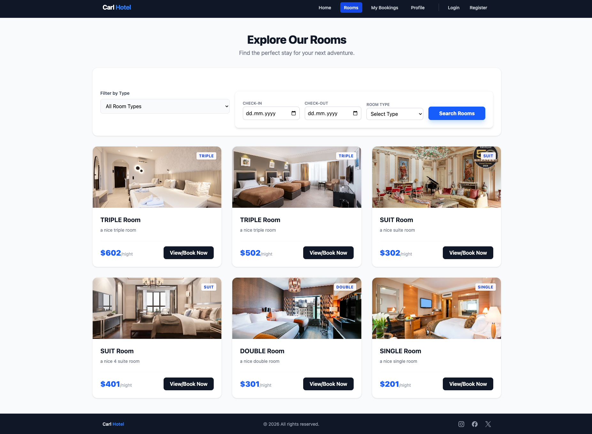
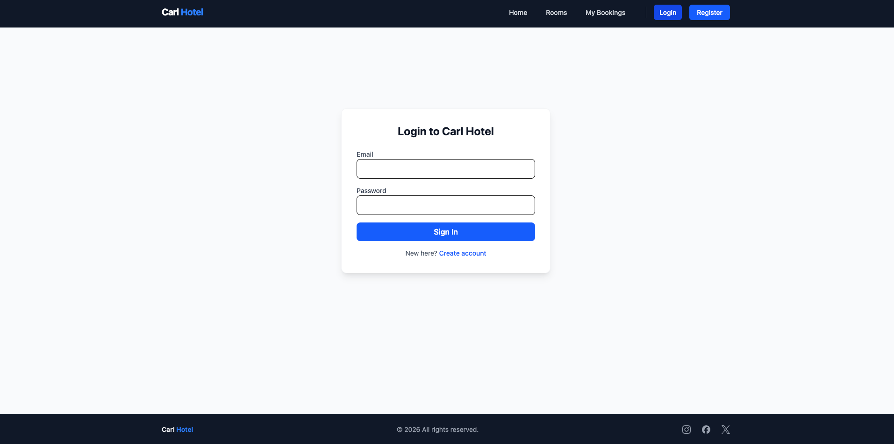

# Full stack Hotel Booking System with Spring Boot, React, Postgres, Docker, Stripe, and Tailwind CSS
Примечание: На данный момент приложение находится в разработке, поэтому его можно запускать только через IntelliJ IDEA, 
так как используются зависимости Spring Boot Docker Compose.

Note: The application is currently under development and can only be launched via IntelliJ IDEA, 
as it relies on Spring Boot Docker Compose dependencies.

# The Current Pages

 - The Home/Main Page
   

 - The Rooms Page

   

 - The register page

    

 - The Login Page

   
   
